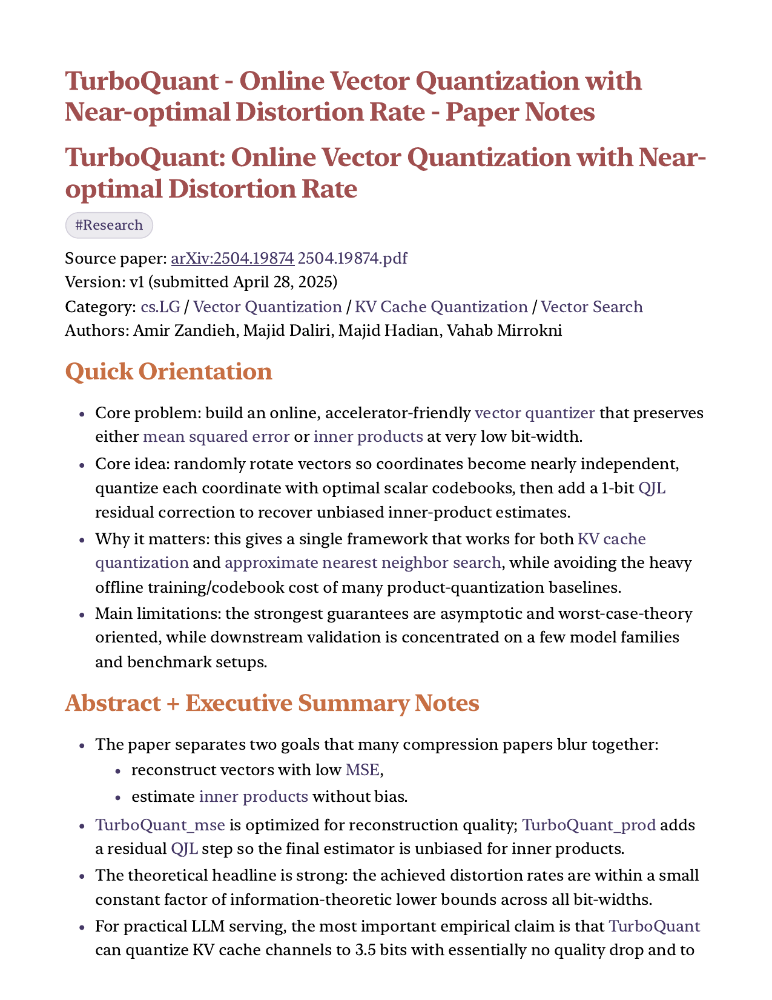
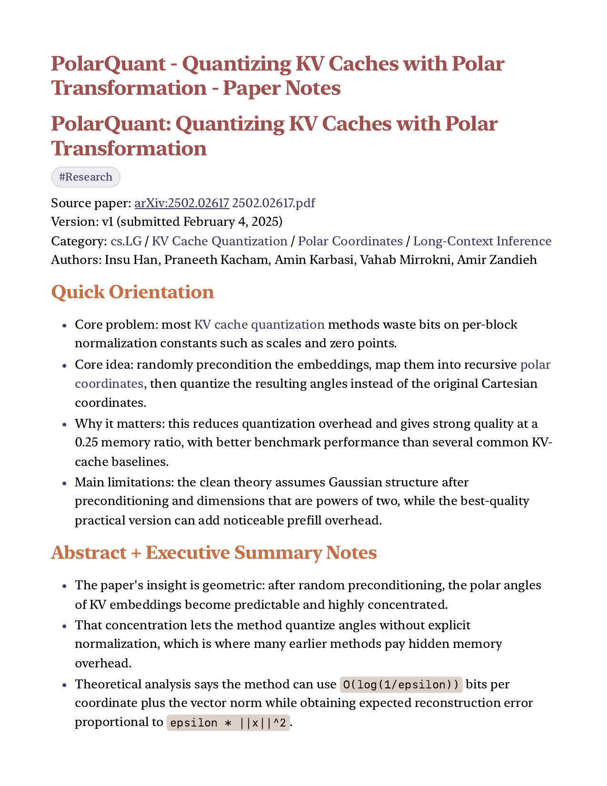
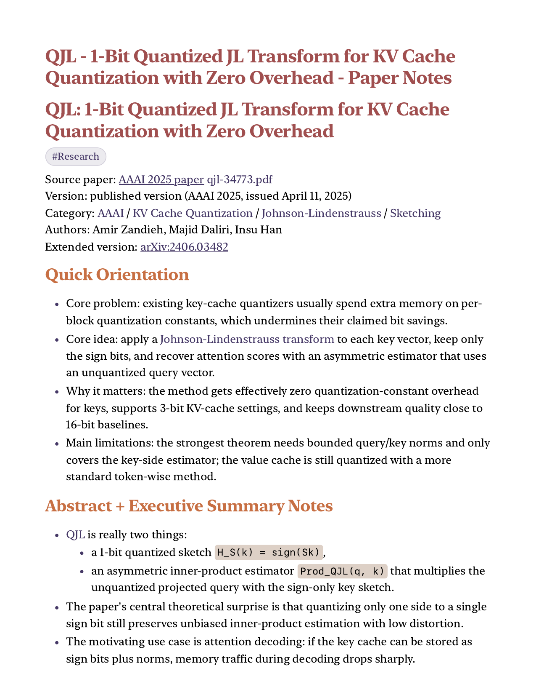

# paper-notes-workflow

A shareable Codex skill for creating standardized Obsidian paper-study notes from PDF or arXiv inputs.

The skill is opinionated toward a research vault layout and emphasizes full figure coverage, section-by-section notes, required frontmatter, and dashboard updates.

## Prerequisite

This skill is intended to be used alongside [kepano/obsidian-skills](https://github.com/kepano/obsidian-skills). In practice, this workflow assumes those companion Obsidian skills are installed for Obsidian-compatible formatting and vault-oriented note workflows.

Install the companion skills first:

```bash
python ~/.codex/skills/.system/skill-installer/scripts/install-skill-from-github.py \
  --repo kepano/obsidian-skills \
  --path skills/obsidian-markdown \
  --path skills/obsidian-cli \
  --path skills/defuddle
```

## What It Does

- Downloads or resolves a paper PDF into `Research/tmp/pdfs/`
- Extracts text for section mapping and note writing
- Extracts embedded figures and supports page-render cropping for missed figures
- Creates a structured Obsidian note with study-oriented sections
- Embeds every figure in the note, including appendix figures
- Updates an existing papers dashboard note

## Repo Layout

```text
skills/
  paper-notes-workflow/
    SKILL.md
    agents/openai.yaml
    references/paper-note-template.md
```

## Assumptions

This skill currently assumes:

- companion skills from `kepano/obsidian-skills` are installed
- an Obsidian vault with a `Research/` folder
- a working PDF staging directory at `Research/tmp/pdfs/`
- a papers dashboard at either `Research/Papers Dashboard.md` or `Research/_ Papers Dashboard.md`
- a workflow that wants Obsidian wikilinks, Dataview-compatible metadata, and note files stored directly under `Research/`

## External Tools

The workflow expects these CLI tools to be available:

- `pdftotext`
- `pdfinfo`
- `pdftoppm`
- `pdfimages`

## Install

Once this repo is on GitHub, install it with the built-in skill installer:

```bash
python ~/.codex/skills/.system/skill-installer/scripts/install-skill-from-github.py \
  --repo davidydu/Research-Paper-Notes-Workflow-Skill \
  --path skills/paper-notes-workflow
```

Then restart Codex.

## Usage

Prompt Codex with a request like:

```text
Use $paper-notes-workflow to create a comprehensive section-by-section Obsidian paper note for this arXiv paper and include every figure in the correct section.
```

## Example Batch Output

This repo includes a real batch example produced from the prompt:

```text
Make research notes for all 3 papers in this link: https://research.google/blog/turboquant-redefining-ai-efficiency-with-extreme-compression/
```

The result was three paper-note markdown files, which were then rendered to PDF for sharing and review. The rendered examples are included under `examples/google-blog-batch/`.

- [TurboQuant example PDF](examples/google-blog-batch/turboquant-paper-notes.pdf)
- [PolarQuant example PDF](examples/google-blog-batch/polarquant-paper-notes.pdf)
- [QJL example PDF](examples/google-blog-batch/qjl-paper-notes.pdf)
- [Example dashboard note](examples/google-blog-batch/sample-vault/Research/_%20Papers%20Dashboard.md)
- [TurboQuant example note](examples/google-blog-batch/sample-vault/Research/TurboQuant%20-%20Online%20Vector%20Quantization%20with%20Near-optimal%20Distortion%20Rate%20-%20Paper%20Notes.md)
- [PolarQuant example note](examples/google-blog-batch/sample-vault/Research/PolarQuant%20-%20Quantizing%20KV%20Caches%20with%20Polar%20Transformation%20-%20Paper%20Notes.md)
- [QJL example note](examples/google-blog-batch/sample-vault/Research/QJL%20-%201-Bit%20Quantized%20JL%20Transform%20for%20KV%20Cache%20Quantization%20with%20Zero%20Overhead%20-%20Paper%20Notes.md)

| TurboQuant | PolarQuant | QJL |
| --- | --- | --- |
| [](examples/google-blog-batch/turboquant-paper-notes.pdf) | [](examples/google-blog-batch/polarquant-paper-notes.pdf) | [](examples/google-blog-batch/qjl-paper-notes.pdf) |

These previews are first-page renders from the generated notes. They are included to show the level of structure, readability, and polish the workflow can produce.

The repo also includes a small sample vault snapshot with the generated markdown notes and the Dataview dashboard note used to index them.

Raw source-paper PDFs and extracted figure directories are intentionally not included in this repository. They add significant weight, and redistributing publisher assets is a worse default than shipping the generated notes plus rendered previews.

## License

MIT
